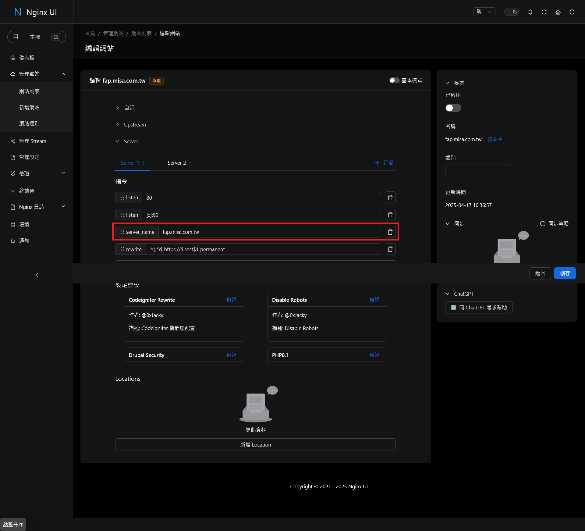

# G7 部署服務流程

在 G7 伺服器部署服務的流程如下：

1. 上傳服務檔案到伺服器的 `/home/web/docker` 目錄下。
2. 調整 `docker-compose.yml` 檔案的設定：network, port 等。
3. 設定 Nginx 的反向代理。
4. 執行 `docker compose up -d` 指令啟動服務。
5. 透過 `docker compose logs` 指令檢查服務的運行狀態。

## 1. 上傳服務檔案到伺服器

透過 SFTP 或 Git 等將服務的檔案上傳到伺服器的 `/home/web/docker` 目錄下。

## 2. 調整 `docker-compose.yml` 檔案的設定

除了服務自身的設定外，還需要調整 `network`, `port` 等設定，範例如下：

```yaml
name: firebase-admin-proxy

services:
  web:
    container_name: firebase-admin-proxy-web
    build:
      context: .
    volumes:
      - ./keys:/usr/src/app/keys
      - ./certs:/usr/src/app/certs
      - ./logs:/usr/src/app/logs
      - ./config.json:/usr/src/app/config.json

    # 移除既有的 ports 設定，改用 Nginx 的反向代理
    # ports:
      # - 3000:3000

    # 新增 networks 設定，ipv4_address 設定為 172.20.*.* 的 IP 位址，請注意不要與其他服務衝突
    networks:
      misa-network
        ipv4_address: 172.20.0.3

# 需新增以下的 networks 設定
networks:
  misa-network:
    external: true
```

## 3. 設定 Nginx 的反向代理

在 Nginx 的設定檔中新增以下的反向代理設定，將請求轉發到 Docker 容器中的 Firebase Admin Proxy 伺服器，可以用文字編輯器 (nano, vim...) 修改 Nginx 的設定檔，或是從 [GUI](https://docker.misa.com.tw/) 進行調整 。

### 3.1 透過文字編輯器修改 Nginx 的設定檔

檔案位址：/etc/nginx/sites-available/{{service_name}}

```nginx
map $http_upgrade $connection_upgrade {
    default upgrade;
    '' close;
}
map $remote_addr $proxy_forwarded_elem {
    # IPv4 addresses can be sent as-is
    ~^[0-9.]+$ "for=$remote_addr";
    # IPv6 addresses need to be bracketed and quoted
    ~^[0-9A-Fa-f:.]+$ "for=\"[$remote_addr]\"";
    # Unix domain socket names cannot be represented in RFC 7239 syntax
    default "for=unknown";
}
map $http_forwarded $proxy_add_forwarded {
    # If the incoming Forwarded header is syntactically valid, append to it
    "~^(,[ \\t]*)*([!#$%&'*+.^_`|~0-9A-Za-z-]+=([!#$%&'*+.^_`|~0-9A-Za-z-]+|\"([\\t \\x21\\x23-\\x5B\\x5D-\\x7E\\x80-\\xFF]|\\\\[\\t \\x21-\\x7E\\x80-\\xFF])*\"))?(;([!#$%&'*+.^_`|~0-9A-Za-z-]+=([!#$%&'*+.^_`|~0-9A-Za-z-]+|\"([\\t \\x21\\x23-\\x5B\\x5D-\\x7E\\x80-\\xFF]|\\\\[\\t \\x21-\\x7E\\x80-\\xFF])*\"))?)*([ \\t]*,([ \\t]*([!#$%&'*+.^_`|~0-9A-Za-z-]+=([!#$%&'*+.^_`|~0-9A-Za-z-]+|\"([\\t \\x21\\x23-\\x5B\\x5D-\\x7E\\x80-\\xFF]|\\\\[\\t \\x21-\\x7E\\x80-\\xFF])*\"))?(;([!#$%&'*+.^_`|~0-9A-Za-z-]+=([!#$%&'*+.^_`|~0-9A-Za-z-]+|\"([\\t \\x21\\x23-\\x5B\\x5D-\\x7E\\x80-\\xFF]|\\\\[\\t \\x21-\\x7E\\x80-\\xFF])*\"))?)*)?)*$" "$http_forwarded, $proxy_forwarded_elem";
    # Otherwise, replace it
    default "$proxy_forwarded_elem";
}
server {
    listen 80;
    listen [::]:80;
    server_name {{service_domain}}
    rewrite ^(.*)$ https://$host$1 permanent;
}
server {
    listen 443 ssl;
    listen [::]:443 ssl;
    server_name fap.misa.com.tw;
    # Cloudflare IP List
    set_real_ip_from 173.245.48.0/20;
    set_real_ip_from 103.21.244.0/22;
    set_real_ip_from 103.22.200.0/22;
    set_real_ip_from 103.31.4.0/22;
    set_real_ip_from 141.101.64.0/18;
    set_real_ip_from 108.162.192.0/18;
    set_real_ip_from 190.93.240.0/20;
    set_real_ip_from 188.114.96.0/20;
    set_real_ip_from 197.234.240.0/22;
    set_real_ip_from 198.41.128.0/17;
    set_real_ip_from 162.158.0.0/15;
    set_real_ip_from 104.16.0.0/13;
    set_real_ip_from 104.24.0.0/14;
    set_real_ip_from 172.64.0.0/13;
    set_real_ip_from 131.0.72.0/22;
    set_real_ip_from 2400:cb00::/32;
    set_real_ip_from 2606:4700::/32;
    set_real_ip_from 2803:f800::/32;
    set_real_ip_from 2405:b500::/32;
    set_real_ip_from 2405:8100::/32;
    set_real_ip_from 2a06:98c0::/29;
    set_real_ip_from 2c0f:f248::/32;
    real_ip_header X-Forwarded-For;
    # SSL Certificate
    ssl_certificate /etc/nginx/ssl/misa/misa-Web-Cloudflare.pem;
    ssl_certificate_key /etc/nginx/ssl/misa/misa-Web-Cloudflare.key;
    # Log File Path
    access_log /var/log/nginx/{{service_name}}.access.log;
    error_log /var/log/nginx/{{service_name}}.error.log;
    if ($host != $server_name) {
        return 404;
    }
    location / {
        real_ip_header X-Forwarded-For;
        real_ip_recursive on;
        proxy_http_version 1.1;
        proxy_set_header Upgrade $http_upgrade;
        proxy_set_header Connection $connection_upgrade;
        client_max_body_size 1000m;
        proxy_redirect off;
        proxy_set_header Host $host;
        proxy_set_header X-Real-IP $remote_addr;
        proxy_set_header X-Forwarded-For $proxy_add_x_forwarded_for;
        proxy_set_header X-Forwarded-Proto $scheme;
        proxy_set_header Forwarded $proxy_add_forwarded;
        # IP Whitelist or `allow all` to allow all IPs
        allow {{whitelisted_ip}};
        # IP Blacklist or `deny all` to deny all IPs not in the whitelist
        deny {{blacklisted_ip}};
        proxy_pass http://{{service_ip}}:{{service_port}}/;
    }
}
```

### 3.2 透過 GUI 修改 Nginx 的設定檔

1. 登入 [GUI](https://docker.misa.com.tw/)。
2. 從側邊欄開啟 `管理網站/網站列表`，點按 `template` 的 `複製` 
3. 在彈出的表單中輸入服務的名稱 
4. 新增的服務會顯示在列表中為 `停用` 狀態，點按 `修改` 
5. 在編輯網站表單 `Server` 項目中，`Server 1` 為 HTTP 協定，`Server 2` 為 HTTPS 協定 
6. 在 `Server 1` 中，修改 `server_name` 為服務的網域 
7. 在 `Server 2` 中，修改以下欄位 
   1. 修改指令 `server_name` 為服務的網域
   2. 修改指令 `access_log` 為 `/var/log/nginx/{service_name}.access.log`
   3. 修改指令 `error_log` 為 `/var/log/nginx/{service_name}.error.log`
   4. 為每一個白名單的 IP 位址，在 `Locations` 的內容新增 `allow {ip_address}`；或是設定 `allow all` 來允許所有 IP 位址
   5. 為每一個黑名單的 IP 位址，在 `Locations` 的內容新增 `deny {ip_address}`;或是設定 `deny all` 來拒絕所有白名單以外的 IP 位址
   6. 在 `Locations` 的內容新增 `proxy_pass http://{service_ip}:{service_port}/;`，其中 `{service_ip}` 為 Docker 容器的 IP 位址，`{service_port}` 為服務暴露的埠號

## 4. 啟動服務

在完成以上步驟後，服務就可以啟動了。需要執行以下的兩個步驟啟動容器及 Nginx。

### 4.1 啟動容器：

執行以下命令啟動 Docker 容器：

```bash
cd /home/web/docker/{service_name}
docker compose up -d
```

### 4.2 啟動 Nginx：

如果用文字編輯器修改 Nginx 的設定檔，則需要重新啟動 Nginx 服務，執行以下命令：

```bash
docker exec -it misa-proxy-server nginx -s reload
```

如果用 GUI 修改 Nginx 的設定檔，需要在以下頁面打開 `已啟用` 開關來啟用 Nginx 的設定：


## 5. 檢查服務的運行狀態

執行以下命令檢查服務的運行狀態：

```bash
cd /home/web/docker/{service_name}
docker compose logs -f
```
